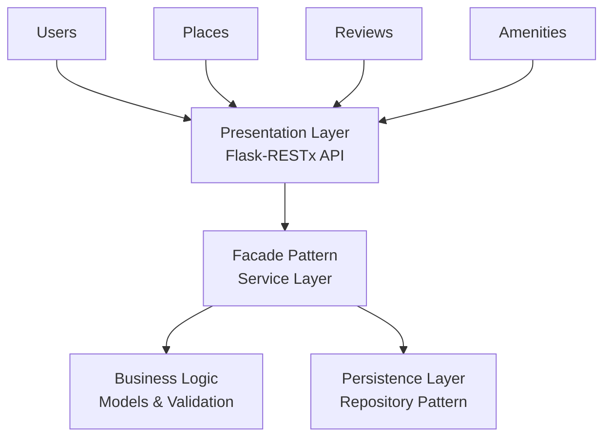

# 🏨 HBnB - Airbnb Clone Project

<div align="center">


*A modular, scalable Airbnb clone built with Flask and modern software architecture patterns*

[📖 Documentation](#documentation) • [🚀 Quick Start](#quick-start) • [🏗️ Architecture](#architecture) • [🛠️ Development](#development)

</div>

---

## 📋 Table of Contents

- [🎯 Overview](#-overview)
- [✨ Features](#-features)
- [🏗️ Architecture](#️-architecture)
- [🚀 Quick Start](#-quick-start)
- [📁 Project Structure](#-project-structure)
- [🛠️ Development](#️-development)
- [📊 API Documentation](#-api-documentation)
- [🔄 Project Phases](#-project-phases)
- [🤝 Contributing](#-contributing)

---

## 🎯 Overview

HBnB is a comprehensive **Airbnb clone** project that demonstrates modern web development practices using Python and Flask. This project showcases a **three-layered architecture** with clean separation of concerns, making it an excellent learning resource for understanding scalable web application design.

### 🎓 Learning Objectives

- **Modular Architecture**: Implement layered design patterns
- **API Development**: Build RESTful APIs with Flask-RESTx
- **Design Patterns**: Apply Facade pattern for clean interfaces
- **Database Integration**: Progress from in-memory to SQLAlchemy ORM
- **Testing & Documentation**: Comprehensive testing and API documentation

---

## ✨ Features

### Current Implementation
- 🏢 **Modular Architecture** - Clean separation between presentation, business, and persistence layers
- 🌐 **RESTful API** - Complete API endpoints for users, places, reviews, and amenities
- 📚 **Interactive Documentation** - Auto-generated Swagger/OpenAPI documentation
- 🔧 **Facade Pattern** - Simplified interface between architectural layers
- 💾 **In-Memory Storage** - Fast prototyping with repository pattern

### Planned Features
- 🗄️ **Database Integration** - SQLAlchemy ORM with PostgreSQL/MySQL
- 🔐 **Authentication & Authorization** - JWT-based user authentication
- 🎨 **Frontend Interface** - React/Vue.js user interface
- 🧪 **Comprehensive Testing** - Unit, integration, and end-to-end tests
- 🚀 **CI/CD Pipeline** - Automated testing and deployment

---

## 🏗️ Architecture



### 🎯 Design Principles

- **Separation of Concerns** - Each layer has a specific responsibility
- **Dependency Injection** - Loose coupling between components
- **Repository Pattern** - Abstract data access layer
- **Facade Pattern** - Simplified interface to complex subsystems

---

## 🚀 Quick Start

### Prerequisites

- **Python 3.9+**
- **Git**
- **Virtual Environment** (recommended)

### Installation

1. **Clone the repository**
   ```bash
   git clone https://github.com/yourusername/holbertonschool-hbnb.git
   cd holbertonschool-hbnb
   ```

2. **Set up virtual environment**
   ```bash
   # On Linux/WSL
   python3 -m venv hbnb-venv
   source hbnb-venv/bin/activate
   
   # On Windows
   python -m venv hbnb-venv
   hbnb-venv\Scripts\activate
   ```

3. **Install dependencies**
   ```bash
   cd part2/hbnb
   pip install -r requirements.txt
   ```

4. **Run the application**
   ```bash
   python run.py
   ```

5. **Access the application**
   - **API Base URL**: http://localhost:5000
   - **Interactive Documentation**: http://localhost:5000/api/v1/

---

## 📁 Project Structure

```
holbertonschool-hbnb/
├── 📂 part1/                          # Project planning & documentation
│   ├── 📄 HBnB_project_Blueprint.md   # Technical specifications
│   ├── 📄 HBnB_project_sys_doc.md     # System documentation
│   └── 🖼️ *.png                      # Architecture diagrams
├── 📂 part2/                          # Core application
│   └── 📂 hbnb/
│       ├── 📂 app/
│       │   ├── 📂 api/                # REST API endpoints
│       │   ├── 📂 models/             # Business logic models
│       │   │   ├── 📄 base_model.py   # Base class with UUID & timestamps
│       │   │   ├── 📄 user.py         # User entity model
│       │   │   ├── 📄 place.py        # Place entity model
│       │   │   ├── 📄 review.py       # Review entity model
│       │   │   └── 📄 amenity.py      # Amenity entity model
│       │   ├── 📂 services/           # Facade layer
│       │   └── 📂 persistence/        # Data access layer
│       ├── 📄 run.py                  # Application entry point
│       ├── 📄 config.py               # Configuration settings
│       ├── 📄 test_models.py          # Comprehensive model tests
│       ├── 📄 test_examples.py        # Simple model examples
│       └── 📄 requirements.txt        # Python dependencies
├── 📂 hbnb-venv/                      # Python virtual environment
├── 📄 README.md                       # This file
└── 📄 VIRTUAL_ENV_SETUP.md           # Environment setup guide
```

---

## 🛠️ Development

### Development Workflow

1. **Activate virtual environment**
   ```bash
   source hbnb-venv/bin/activate  # Linux/WSL
   # or
   hbnb-venv\Scripts\activate     # Windows
   ```

2. **Navigate to project directory**
   ```bash
   cd part2/hbnb
   ```

3. **Run in development mode**
   ```bash
   python run.py
   ```

### Testing

```bash
# Test business logic models
python test_models.py

# Run simple model examples
python test_examples.py

# Run the setup test
python test_complete.py

# Verify imports work correctly
python -c "from app import create_app; print('✅ Setup successful!')"
```

### Environment Variables

| Variable | Description | Default |
|----------|-------------|---------|
| `FLASK_ENV` | Flask environment | `development` |
| `FLASK_DEBUG` | Debug mode | `True` |
| `SECRET_KEY` | Application secret key | `default_secret_key` |

---

## 📊 API Documentation

The application provides interactive API documentation via Swagger/OpenAPI interface.

### Available Endpoints

| Method | Endpoint | Description |
|--------|----------|-------------|
| `GET` | `/api/v1/` | API documentation |
| `GET` | `/api/v1/users` | List all users |
| `POST` | `/api/v1/users` | Create new user |
| `GET` | `/api/v1/places` | List all places |
| `POST` | `/api/v1/places` | Create new place |
| `GET` | `/api/v1/reviews` | List all reviews |
| `POST` | `/api/v1/reviews` | Create new review |
| `GET` | `/api/v1/amenities` | List all amenities |
| `POST` | `/api/v1/amenities` | Create new amenity |

### Example API Response

```json
{
  "id": "1234-5678-9012",
  "name": "Cozy Downtown Apartment",
  "description": "A beautiful apartment in the heart of the city",
  "price_per_night": 120.00,
  "latitude": 37.7749,
  "longitude": -122.4194,
  "owner_id": "user-1234"
}
```

---

## 🔄 Project Phases

### ✅ Part 1: Planning & Design
- [x] System architecture design
- [x] Technical specifications
- [x] UML diagrams and documentation
- [x] API endpoint planning

### 🚧 Part 2: Core Implementation (Current)
- [x] Flask application setup
- [x] Modular architecture implementation
- [x] **Business Logic Models** - Complete implementation with validation
- [x] **Core Entity Classes** - User, Place, Review, Amenity
- [x] **Model Relationships** - Proper entity relationships and constraints
- [x] **Comprehensive Testing** - Model validation and business logic tests
- [x] In-memory data persistence
- [x] API endpoints structure
- [ ] Complete CRUD operations
- [ ] Data validation and error handling

### 🔮 Part 3: Database Integration (Planned)
- [ ] SQLAlchemy ORM integration
- [ ] Database models and relationships
- [ ] Migration system
- [ ] Advanced querying

### 🔮 Part 4: Advanced Features (Planned)
- [ ] User authentication & authorization
- [ ] File upload for images
- [ ] Search and filtering
- [ ] Payment integration

---

## 🧩 Business Logic Layer

### Core Models

The HBnB application implements a comprehensive business logic layer with four main entity classes:

#### 🙋‍♂️ **User Model**
- **Attributes**: `id`, `first_name`, `last_name`, `email`, `is_admin`, `created_at`, `updated_at`
- **Validation**: Email format validation, name length limits (50 chars), unique email addresses
- **Relationships**: One-to-many with Places (as owner), one-to-many with Reviews (as author)

#### 🏠 **Place Model**
- **Attributes**: `id`, `title`, `description`, `price`, `latitude`, `longitude`, `owner`, `created_at`, `updated_at`
- **Validation**: Price must be positive, coordinates within valid ranges, title max 100 chars
- **Relationships**: Belongs to User (owner), has many Reviews, many-to-many with Amenities

#### ⭐ **Review Model**
- **Attributes**: `id`, `text`, `rating`, `place`, `user`, `created_at`, `updated_at`
- **Validation**: Rating 1-5, non-empty text, business rule: users cannot review own places
- **Relationships**: Belongs to Place and User

#### 🏨 **Amenity Model**
- **Attributes**: `id`, `name`, `created_at`, `updated_at`
- **Validation**: Name required, max 50 chars
- **Relationships**: Many-to-many with Places

### 🛡️ Key Features

- **UUID Identifiers**: All entities use UUID4 for global uniqueness and security
- **Automatic Timestamps**: `created_at` and `updated_at` managed automatically
- **Comprehensive Validation**: Input validation with meaningful error messages
- **Business Logic**: Enforced rules (e.g., users cannot review their own places)
- **Relationship Management**: Methods for managing entity relationships
- **Data Integrity**: Protected attributes and validation on updates

### 📝 Usage Examples

```python
# Create a user
user = User(first_name="John", last_name="Doe", email="john@example.com")

# Create a place
place = Place(
    title="Cozy Apartment",
    description="A beautiful downtown apartment",
    price=120.00,
    latitude=37.7749,
    longitude=-122.4194,
    owner=user
)

# Add amenities
wifi = Amenity(name="Wi-Fi")
parking = Amenity(name="Parking")
place.add_amenity(wifi)
place.add_amenity(parking)

# Create a review (by different user)
reviewer = User(first_name="Jane", last_name="Smith", email="jane@example.com")
review = Review(text="Great place to stay!", rating=5, place=place, user=reviewer)
place.add_review(review)
```

### 🧪 Testing

Run the business logic tests to validate implementation:

```bash
# Run simple examples
python test_examples.py

# Run comprehensive test suite
python test_models.py
```

---

## 🤝 Contributing

We welcome contributions! Please see our contributing guidelines:

1. **Fork the repository**
2. **Create a feature branch** (`git checkout -b feature/amazing-feature`)
3. **Commit your changes** (`git commit -m 'Add some amazing feature'`)
4. **Push to the branch** (`git push origin feature/amazing-feature`)
5. **Open a Pull Request**

### Development Guidelines

- Follow PEP 8 style guidelines
- Write comprehensive tests
- Update documentation as needed
- Use meaningful commit messages

---

## 🙏 Acknowledgments

- **Holberton School** - Educational framework and guidance
- **Flask Community** - Excellent web framework and documentation
- **Open Source Community** - Libraries and tools that make this possible

---

<div align="center">

**⭐ Star this repository if you found it helpful!**

[Report Bug](https://github.com/yourusername/holbertonschool-hbnb/issues) • [Request Feature](https://github.com/yourusername/holbertonschool-hbnb/issues) • [Documentation](./part1/)

Made with ❤️ for learning and sharing knowledge

</div>