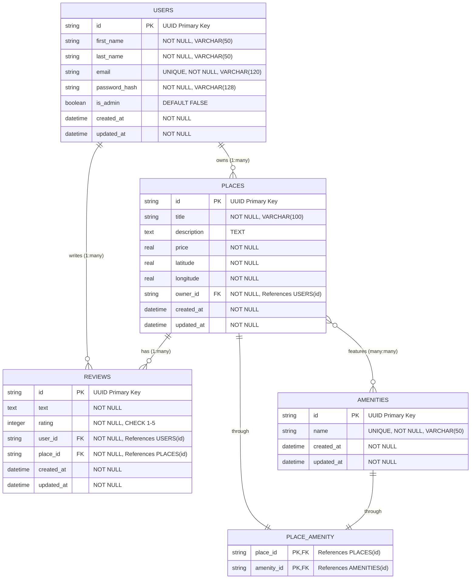

# HBnB Database Schema Diagram

## Entity Relationship Diagram



## Database Constraints and Business Rules

### Primary Keys
- All entities use UUID strings as primary keys for global uniqueness
- UUIDs are generated automatically using Python's `uuid.uuid4()`

### Foreign Key Relationships
1. **PLACES.owner_id → USERS.id**
   - Each place must have an owner (user)
   - Cascade delete: when a user is deleted, their places are deleted

2. **REVIEWS.user_id → USERS.id**
   - Each review must be written by a user
   - Cascade delete: when a user is deleted, their reviews are deleted

3. **REVIEWS.place_id → PLACES.id**
   - Each review must be for a specific place
   - Cascade delete: when a place is deleted, its reviews are deleted

4. **PLACE_AMENITY Association Table**
   - Links places to amenities in a many-to-many relationship
   - Cascade delete: when place or amenity is deleted, associations are removed

### Unique Constraints
- `USERS.email` - Each user must have a unique email address
- `AMENITIES.name` - Each amenity name must be unique
- `REVIEWS(user_id, place_id)` - One review per user per place

### Check Constraints
- `REVIEWS.rating` - Must be between 1 and 5 (inclusive)
- `PLACES.price` - Must be positive
- `PLACES.latitude` - Must be between -90 and 90
- `PLACES.longitude` - Must be between -180 and 180

### Indexes for Performance
- `idx_users_email` on USERS.email for login lookups
- `idx_places_owner_id` on PLACES.owner_id for owner's places
- `idx_reviews_user_id` on REVIEWS.user_id for user's reviews
- `idx_reviews_place_id` on REVIEWS.place_id for place reviews

## SQLAlchemy Model Relationships

```mermaid
classDiagram
    class BaseModelDB {
        +String id
        +DateTime created_at
        +DateTime updated_at
        +save()
        +update(data)
        +delete()
        +to_dict()
    }

    class UserDB {
        +String first_name
        +String last_name
        +String email
        +String password_hash
        +Boolean is_admin
        +set_password(password)
        +check_password(password)
        +find_by_email(email)
    }

    class PlaceDB {
        +String title
        +String description
        +Float price
        +Float latitude
        +Float longitude
        +String owner_id
        +find_by_owner(owner_id)
    }

    class ReviewDB {
        +String text
        +Integer rating
        +String user_id
        +String place_id
        +find_by_place(place_id)
        +find_by_user(user_id)
        +find_by_user_and_place(user_id, place_id)
    }

    class AmenityDB {
        +String name
        +find_by_name(name)
    }

    BaseModelDB <|-- UserDB
    BaseModelDB <|-- PlaceDB
    BaseModelDB <|-- ReviewDB
    BaseModelDB <|-- AmenityDB

    UserDB "1" o-- "many" PlaceDB : owns
    UserDB "1" o-- "many" ReviewDB : writes
    PlaceDB "1" o-- "many" ReviewDB : receives
    PlaceDB "many" o-- "many" AmenityDB : features


## API Authentication and Authorization

```mermaid
flowchart TD
    A[API Request] --> B{Requires JWT?}
    B -->|No| C[Public Endpoint]
    B -->|Yes| D{Valid JWT?}
    D -->|No| E[401 Unauthorized]
    D -->|Yes| F{Admin Required?}
    F -->|No| G{Owner Required?}
    F -->|Yes| H{Is Admin?}
    H -->|No| I[403 Forbidden]
    H -->|Yes| J[Allow Access]
    G -->|No| J
    G -->|Yes| K{Is Owner or Admin?}
    K -->|No| I
    K -->|Yes| J
    C --> L[Process Request]
    J --> L
```

## Database File Locations

- **Development**: `hbnb_dev.db`
- **Testing**: In-memory SQLite database
- **Production**: `hbnb_prod.db`

All database files are created in the application root directory unless a full path is specified in the `DATABASE_URL` environment variable.
