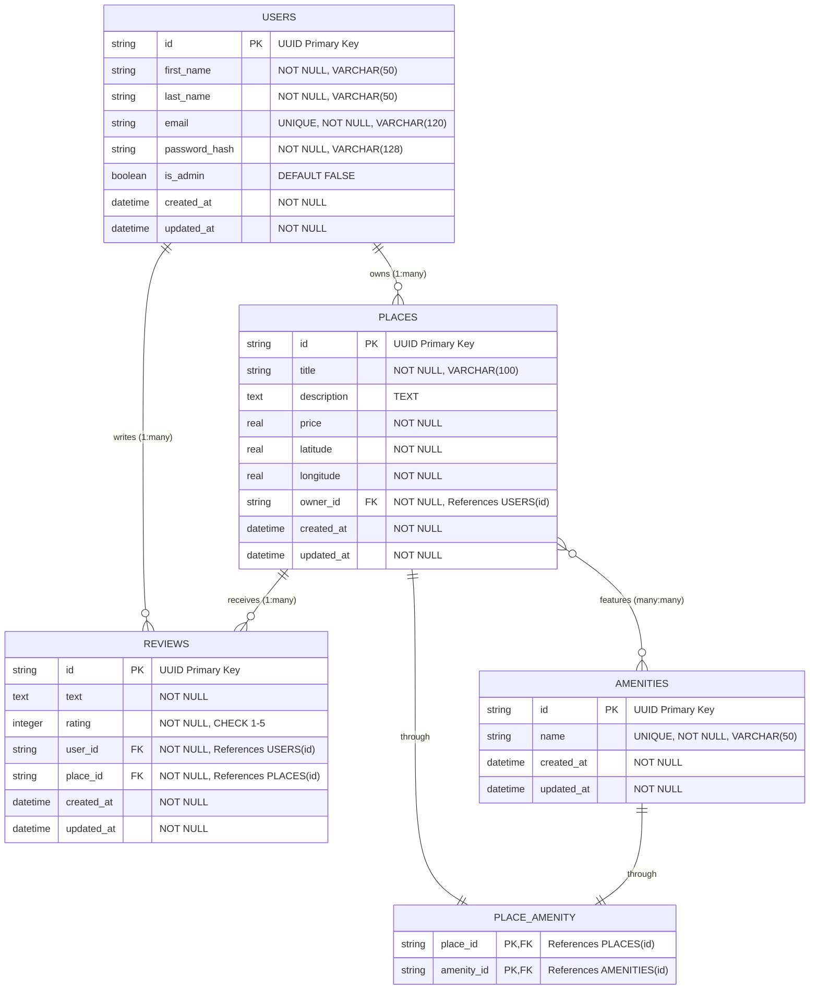
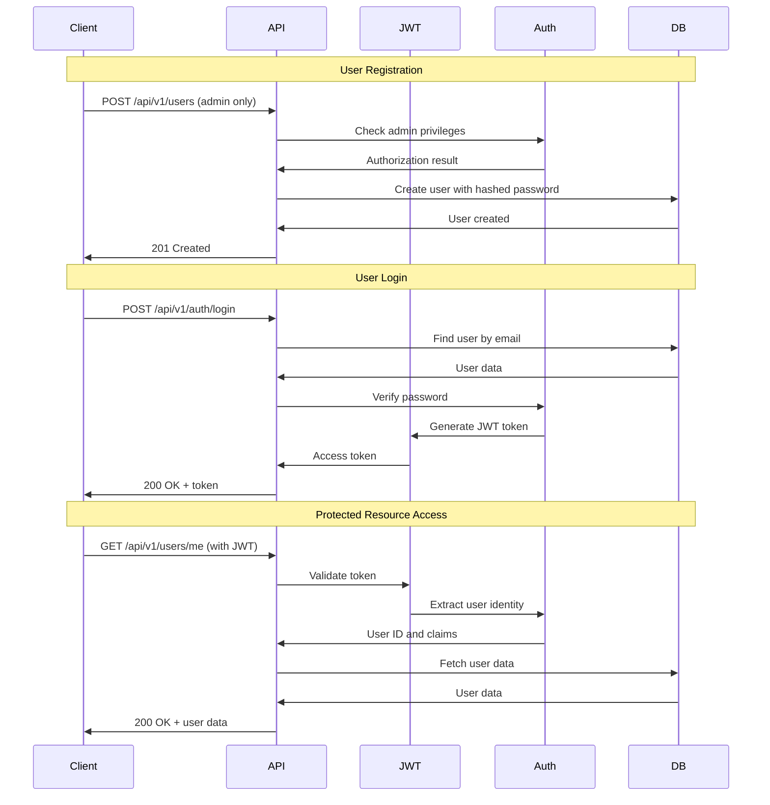

# HBnB Database Schema Documentation

## Overview

This document provides comprehensive documentation for the HBnB application database schema, including entity relationships, constraints, and SQLAlchemy model mappings.

## Entity Relationship Diagram



## SQLAlchemy Model Architecture

```mermaid
classDiagram
    class BaseModel {
        +String id
        +DateTime created_at
        +DateTime updated_at
        +save()
        +update(data)
        +to_dict()
        +__str__()
        +__repr__()
    }
    
    class UserDB {
        +String first_name
        +String last_name
        +String email
        +String password_hash
        +Boolean is_admin
        +set_password(password)
        +check_password(password)
        +find_by_email(email)
        +List~PlaceDB~ places
        +List~ReviewDB~ reviews
    }
    
    class PlaceDB {
        +String title
        +String description
        +Float price
        +Float latitude
        +Float longitude
        +String owner_id
        +UserDB owner
        +List~ReviewDB~ reviews
        +List~AmenityDB~ amenities
        +find_by_owner(owner_id)
        +_validate()
    }
    
    class ReviewDB {
        +String text
        +Integer rating
        +String user_id
        +String place_id
        +UserDB user
        +PlaceDB place
        +find_by_place(place_id)
        +find_by_user(user_id)
        +find_by_user_and_place(user_id, place_id)
        +_validate()
    }
    
    class AmenityDB {
        +String name
        +List~PlaceDB~ places
        +find_by_name(name)
        +_validate()
    }
    
    db.Model <|-- UserDB
    db.Model <|-- PlaceDB
    db.Model <|-- ReviewDB
    db.Model <|-- AmenityDB
    
    UserDB ||--o{ PlaceDB : "owns"
    UserDB ||--o{ ReviewDB : "writes"
    PlaceDB ||--o{ ReviewDB : "receives"
    PlaceDB }o--o{ AmenityDB : "features"
```

## Database Tables

### Users Table
Stores user account information and authentication data.

```sql
CREATE TABLE users (
    id VARCHAR(36) PRIMARY KEY,
    first_name VARCHAR(50) NOT NULL,
    last_name VARCHAR(50) NOT NULL,
    email VARCHAR(120) UNIQUE NOT NULL,
    password_hash VARCHAR(128) NOT NULL,
    is_admin BOOLEAN DEFAULT FALSE NOT NULL,
    created_at DATETIME NOT NULL,
    updated_at DATETIME NOT NULL
);

CREATE INDEX idx_users_email ON users(email);
```

**Constraints:**
- Primary Key: `id` (UUID)
- Unique: `email`
- Not Null: `first_name`, `last_name`, `email`, `password_hash`
- Default: `is_admin = FALSE`

### Places Table
Stores property/place listings with location and pricing information.

```sql
CREATE TABLE places (
    id VARCHAR(36) PRIMARY KEY,
    title VARCHAR(100) NOT NULL,
    description TEXT,
    price REAL NOT NULL,
    latitude REAL NOT NULL,
    longitude REAL NOT NULL,
    owner_id VARCHAR(36) NOT NULL,
    created_at DATETIME NOT NULL,
    updated_at DATETIME NOT NULL,
    FOREIGN KEY (owner_id) REFERENCES users(id) ON DELETE CASCADE
);

CREATE INDEX idx_places_owner_id ON places(owner_id);
```

**Constraints:**
- Primary Key: `id` (UUID)
- Foreign Key: `owner_id` → `users(id)` (CASCADE DELETE)
- Not Null: `title`, `price`, `latitude`, `longitude`, `owner_id`
- Check: `price > 0`, `latitude BETWEEN -90 AND 90`, `longitude BETWEEN -180 AND 180`

### Reviews Table
Stores user reviews for places with ratings and text feedback.

```sql
CREATE TABLE reviews (
    id VARCHAR(36) PRIMARY KEY,
    text TEXT NOT NULL,
    rating INTEGER NOT NULL CHECK (rating >= 1 AND rating <= 5),
    user_id VARCHAR(36) NOT NULL,
    place_id VARCHAR(36) NOT NULL,
    created_at DATETIME NOT NULL,
    updated_at DATETIME NOT NULL,
    FOREIGN KEY (user_id) REFERENCES users(id) ON DELETE CASCADE,
    FOREIGN KEY (place_id) REFERENCES places(id) ON DELETE CASCADE,
    UNIQUE(user_id, place_id)
);

CREATE INDEX idx_reviews_user_id ON reviews(user_id);
CREATE INDEX idx_reviews_place_id ON reviews(place_id);
```

**Constraints:**
- Primary Key: `id` (UUID)
- Foreign Keys: `user_id` → `users(id)`, `place_id` → `places(id)` (CASCADE DELETE)
- Unique: `(user_id, place_id)` - One review per user per place
- Check: `rating BETWEEN 1 AND 5`
- Not Null: `text`, `rating`, `user_id`, `place_id`

### Amenities Table
Stores available amenities that can be associated with places.

```sql
CREATE TABLE amenities (
    id VARCHAR(36) PRIMARY KEY,
    name VARCHAR(50) UNIQUE NOT NULL,
    created_at DATETIME NOT NULL,
    updated_at DATETIME NOT NULL
);
```

**Constraints:**
- Primary Key: `id` (UUID)
- Unique: `name`
- Not Null: `name`

### Place-Amenity Association Table
Many-to-many relationship between places and amenities.

```sql
CREATE TABLE place_amenity (
    place_id VARCHAR(36) NOT NULL,
    amenity_id VARCHAR(36) NOT NULL,
    PRIMARY KEY (place_id, amenity_id),
    FOREIGN KEY (place_id) REFERENCES places(id) ON DELETE CASCADE,
    FOREIGN KEY (amenity_id) REFERENCES amenities(id) ON DELETE CASCADE
);
```

**Constraints:**
- Composite Primary Key: `(place_id, amenity_id)`
- Foreign Keys: `place_id` → `places(id)`, `amenity_id` → `amenities(id)` (CASCADE DELETE)

## Authentication and Authorization Flow



## Business Rules and Constraints

### User Management
- **Registration**: Admin-only operation (except for initial setup)
- **Password Requirements**: Minimum 6 characters, bcrypt hashed
- **Email Uniqueness**: Each email can only be associated with one account
- **Admin Privileges**: Required for system-wide operations

### Place Management
- **Ownership**: Users can only modify their own places (admins can modify any)
- **Location Validation**: Latitude (-90 to 90), Longitude (-180 to 180)
- **Price Validation**: Must be positive number
- **Title Requirements**: Required, maximum 100 characters

### Review System
- **One Review Per User Per Place**: Enforced by unique constraint
- **Rating Range**: Integer between 1 and 5 (inclusive)
- **Ownership**: Users can only modify their own reviews (admins can modify any)
- **Cascade Deletion**: Reviews deleted when user or place is deleted

### Amenity System
- **Admin Management**: Only admins can create, update, or delete amenities
- **Name Uniqueness**: Each amenity name must be unique
- **Many-to-Many**: Places can have multiple amenities, amenities can be used by multiple places

## Security Features

### Password Security
- **Bcrypt Hashing**: All passwords hashed using bcrypt with salt
- **No Plain Text Storage**: Passwords never stored in plain text
- **API Exclusion**: Password hashes excluded from API responses

### JWT Authentication
- **Token-Based**: Stateless authentication using JWT tokens
- **Claims**: User ID and admin status embedded in token
- **Expiration**: Configurable token expiration (disabled for development)

### Authorization Levels
1. **Public**: Anonymous access (GET operations for places, amenities, reviews)
2. **Authenticated**: Requires valid JWT token
3. **Owner**: Resource owner or admin required
4. **Admin**: Admin privileges required

## Database Configuration

### Environment-Specific Settings

#### Development
```python
SQLALCHEMY_DATABASE_URI = 'sqlite:///hbnb_dev.db'
SQLALCHEMY_TRACK_MODIFICATIONS = False
```

#### Testing
```python
SQLALCHEMY_DATABASE_URI = 'sqlite:///:memory:'
SQLALCHEMY_TRACK_MODIFICATIONS = False
```

#### Production
```python
SQLALCHEMY_DATABASE_URI = os.getenv('DATABASE_URL', 'sqlite:///hbnb_prod.db')
SQLALCHEMY_TRACK_MODIFICATIONS = False
```

## Performance Optimizations

### Indexes
- `idx_users_email`: Fast email lookups for authentication
- `idx_places_owner_id`: Fast owner-based place queries
- `idx_reviews_user_id`: Fast user review queries
- `idx_reviews_place_id`: Fast place review queries

### Query Optimizations
- Relationship loading strategies
- Eager loading for frequently accessed relationships
- Lazy loading for optional relationships

## Migration and Initialization

### Database Initialization
```bash
# Initialize database with tables
python init_db.py

# Create tables only
python -c "from app import create_app, db; app = create_app(); app.app_context().push(); db.create_all()"
```

### Sample Data Population
The `init_db.py` script includes sample data:
- Admin user
- Regular users
- Sample amenities
- Sample places with amenity associations
- Sample reviews

## Backup and Recovery

### Database Backup
```bash
# SQLite backup
cp hbnb_dev.db hbnb_dev_backup_$(date +%Y%m%d_%H%M%S).db
```

### Data Export
```python
# Export data to SQL
from app import create_app, db
app = create_app()
with app.app_context():
    # Use SQLAlchemy-Utils or custom export logic
    pass
```

This documentation provides a complete reference for the HBnB database schema, relationships, and implementation details.
