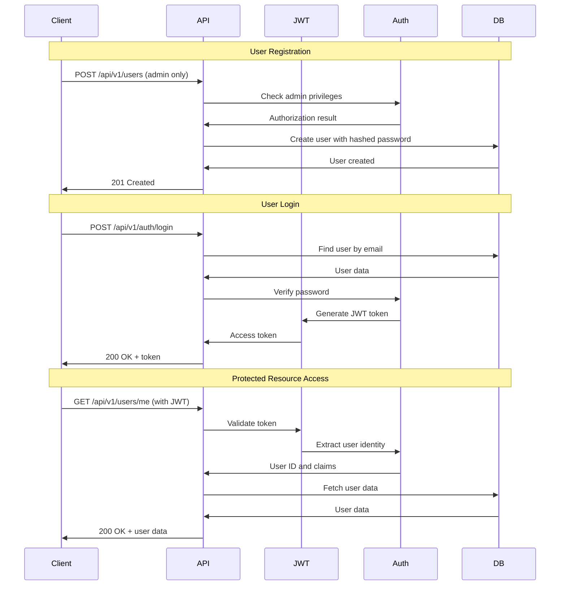
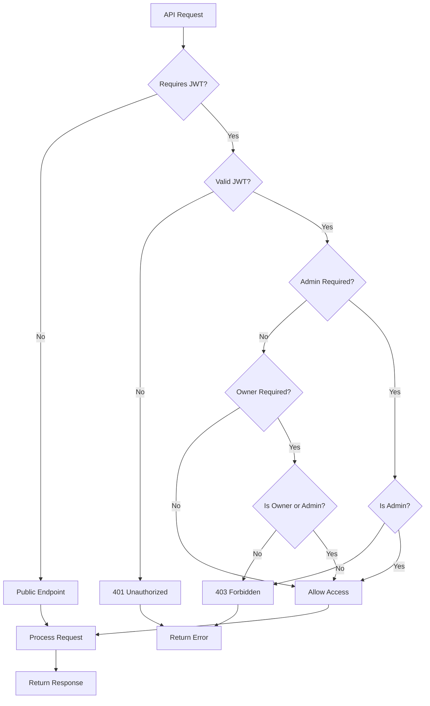

# Authentication Flow

## JWT Authentication and Authorization Sequence

This document describes the complete authentication and authorization flow for the HBnB application.

## Authentication Sequence Diagram



## Authorization Flow Diagram



## Authentication Endpoints

### User Registration
**Endpoint**: `POST /api/v1/users`
**Access Level**: Admin Only
**Purpose**: Create new user accounts

```http
POST /api/v1/users
Authorization: Bearer <admin_jwt_token>
Content-Type: application/json

{
    "first_name": "John",
    "last_name": "Doe",
    "email": "john@example.com",
    "password": "securepassword123",
    "is_admin": false
}
```

**Response**:
```json
{
    "id": "uuid-string",
    "first_name": "John",
    "last_name": "Doe",
    "email": "john@example.com",
    "is_admin": false,
    "created_at": "2024-01-01T12:00:00Z",
    "updated_at": "2024-01-01T12:00:00Z"
}
```

### User Login
**Endpoint**: `POST /api/v1/auth/login`
**Access Level**: Public
**Purpose**: Authenticate user and receive JWT token

```http
POST /api/v1/auth/login
Content-Type: application/json

{
    "email": "john@example.com",
    "password": "securepassword123"
}
```

**Response**:
```json
{
    "access_token": "eyJ0eXAiOiJKV1QiLCJhbGciOiJIUzI1NiJ9...",
    "user": {
        "id": "uuid-string",
        "first_name": "John",
        "last_name": "Doe",
        "email": "john@example.com",
        "is_admin": false
    }
}
```

### Protected User Info
**Endpoint**: `GET /api/v1/auth/me`
**Access Level**: Authenticated
**Purpose**: Get current user information

```http
GET /api/v1/auth/me
Authorization: Bearer <jwt_token>
```

**Response**:
```json
{
    "id": "uuid-string",
    "first_name": "John",
    "last_name": "Doe",
    "email": "john@example.com",
    "is_admin": false,
    "created_at": "2024-01-01T12:00:00Z",
    "updated_at": "2024-01-01T12:00:00Z"
}
```

## JWT Token Structure

### Token Claims
```json
{
    "sub": "user-uuid-string",      // Subject (User ID)
    "iat": 1642780800,              // Issued At timestamp
    "exp": null,                    // Expiration (disabled for dev)
    "is_admin": false,              // Admin privileges flag
    "email": "john@example.com"     // User email
}
```

### Token Validation Process
1. **Extract Token**: Get JWT from Authorization header
2. **Verify Signature**: Validate token signature with secret key
3. **Check Expiration**: Verify token hasn't expired (if enabled)
4. **Extract Claims**: Get user ID and admin status
5. **Load User**: Fetch current user data from database

## Authorization Levels

### 1. Public Access
**Description**: No authentication required
**Endpoints**:
- `GET /api/v1/places` - List all places
- `GET /api/v1/places/{id}` - Get place details
- `GET /api/v1/amenities` - List all amenities
- `GET /api/v1/reviews` - List reviews (filtered by place)
- `POST /api/v1/auth/login` - User login

### 2. Authenticated Access
**Description**: Valid JWT token required
**Endpoints**:
- `GET /api/v1/auth/me` - Get current user info
- `POST /api/v1/places` - Create new place
- `POST /api/v1/reviews` - Create new review

### 3. Owner Access
**Description**: Resource owner or admin required
**Endpoints**:
- `PUT /api/v1/users/{id}` - Update user (self or admin)
- `PUT /api/v1/places/{id}` - Update place (owner or admin)
- `DELETE /api/v1/places/{id}` - Delete place (owner or admin)
- `PUT /api/v1/reviews/{id}` - Update review (author or admin)
- `DELETE /api/v1/reviews/{id}` - Delete review (author or admin)

### 4. Admin Access
**Description**: Admin privileges required
**Endpoints**:
- `POST /api/v1/users` - Create new user
- `DELETE /api/v1/users/{id}` - Delete user
- `POST /api/v1/amenities` - Create new amenity
- `PUT /api/v1/amenities/{id}` - Update amenity
- `DELETE /api/v1/amenities/{id}` - Delete amenity

## Security Implementation

### Password Security
```python
# Password hashing (during registration/update)
from flask_bcrypt import Bcrypt
bcrypt = Bcrypt()

# Hash password
password_hash = bcrypt.generate_password_hash(password).decode('utf-8')

# Verify password (during login)
is_valid = bcrypt.check_password_hash(user.password_hash, password)
```

### JWT Token Generation
```python
from flask_jwt_extended import create_access_token

# Create JWT token
access_token = create_access_token(
    identity=user.id,
    additional_claims={
        'is_admin': user.is_admin,
        'email': user.email
    }
)
```

### Authorization Decorators
```python
from flask_jwt_extended import jwt_required, get_jwt_identity, get_jwt

@jwt_required()
def protected_endpoint():
    current_user_id = get_jwt_identity()
    claims = get_jwt()
    is_admin = claims.get('is_admin', False)
    # ... endpoint logic
```

## Error Handling

### Authentication Errors
- **401 Unauthorized**: Missing or invalid JWT token
- **403 Forbidden**: Valid token but insufficient privileges
- **400 Bad Request**: Invalid login credentials

### Error Response Format
```json
{
    "error": "Token has expired",
    "status_code": 401
}
```

### Common Error Scenarios
1. **Missing Token**: No Authorization header provided
2. **Invalid Token**: Malformed or corrupted JWT
3. **Expired Token**: Token past expiration time (if enabled)
4. **Insufficient Privileges**: Valid user but wrong access level
5. **User Not Found**: Token valid but user no longer exists

## Security Best Practices

### Token Security
- ✅ Strong JWT secret key (environment variable)
- ✅ HTTPS required in production
- ✅ Token expiration configurable
- ✅ No sensitive data in token payload

### Password Security
- ✅ Bcrypt hashing with salt
- ✅ Minimum password length (6 characters)
- ✅ Password never stored in plain text
- ✅ Password hash excluded from API responses

### Access Control
- ✅ Role-based access (admin vs regular user)
- ✅ Resource ownership validation
- ✅ Consistent authorization patterns
- ✅ Admin override for system operations

This authentication flow ensures secure access to the HBnB application while maintaining usability and flexibility for different user roles.
