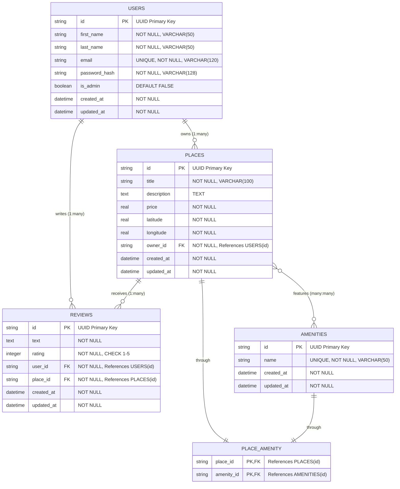

# Entity Relationship Diagram

## HBnB Database ERD

This diagram shows the complete entity relationship structure for the HBnB application database.

## Relationship Descriptions

### One-to-Many Relationships

#### Users → Places (owns)
- **Description**: One user can own multiple places
- **Foreign Key**: `places.owner_id` → `users.id`
- **Cascade**: DELETE CASCADE (when user is deleted, their places are deleted)
- **Business Rule**: Users can only modify their own places (except admins)

#### Users → Reviews (writes)
- **Description**: One user can write multiple reviews
- **Foreign Key**: `reviews.user_id` → `users.id`
- **Cascade**: DELETE CASCADE (when user is deleted, their reviews are deleted)
- **Business Rule**: Users can only modify their own reviews (except admins)

#### Places → Reviews (receives)
- **Description**: One place can receive multiple reviews
- **Foreign Key**: `reviews.place_id` → `places.id`
- **Cascade**: DELETE CASCADE (when place is deleted, its reviews are deleted)
- **Business Rule**: Only one review per user per place (unique constraint)

### Many-to-Many Relationships

#### Places ↔ Amenities (features)
- **Description**: Places can have multiple amenities, amenities can be used by multiple places
- **Association Table**: `place_amenity`
- **Keys**: 
  - `place_amenity.place_id` → `places.id`
  - `place_amenity.amenity_id` → `amenities.id`
- **Cascade**: DELETE CASCADE (when place or amenity is deleted, associations are removed)
- **Business Rule**: Admin-only management of amenities

## Entity Descriptions

### USERS
**Purpose**: Store user account information and authentication data
- **Primary Key**: UUID string identifier
- **Unique Constraints**: Email address
- **Security**: Password stored as bcrypt hash
- **Authorization**: Admin flag for elevated privileges

### PLACES
**Purpose**: Store property/place listings with location and pricing
- **Primary Key**: UUID string identifier
- **Location**: Latitude/longitude coordinates with validation
- **Ownership**: Linked to user via foreign key
- **Pricing**: Positive decimal values only

### REVIEWS
**Purpose**: Store user feedback and ratings for places
- **Primary Key**: UUID string identifier
- **Rating**: Integer 1-5 scale with validation
- **Uniqueness**: One review per user per place
- **Content**: Text feedback from users

### AMENITIES
**Purpose**: Store available features that places can offer
- **Primary Key**: UUID string identifier
- **Uniqueness**: Amenity names must be unique
- **Management**: Admin-only creation/modification

### PLACE_AMENITY
**Purpose**: Association table for many-to-many relationship
- **Composite Key**: (place_id, amenity_id)
- **Function**: Links places to their available amenities
- **Maintenance**: Automatically managed through SQLAlchemy relationships

## Data Integrity Features

### Primary Keys
- All entities use UUID strings for global uniqueness
- UUIDs generated automatically using Python's `uuid.uuid4()`
- No auto-incrementing integers to avoid conflicts

### Foreign Key Constraints
- Enforced referential integrity
- CASCADE DELETE for dependent records
- Prevents orphaned records

### Unique Constraints
- User email addresses must be unique
- Amenity names must be unique
- One review per user per place combination

### Check Constraints
- Review ratings must be 1-5
- Place prices must be positive
- Coordinate validation for place locations

This ERD provides the foundation for understanding all data relationships and constraints in the HBnB application.
