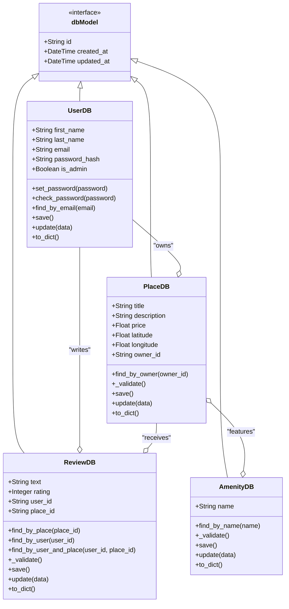

# SQLAlchemy Model Architecture

## Class Diagram

This diagram shows the SQLAlchemy model architecture and inheritance structure.



## Model Descriptions

### Base Model (db.Model)
All SQLAlchemy models inherit from Flask-SQLAlchemy's `db.Model`, providing:
- **Automatic table mapping**
- **Session management**
- **Query interface**
- **Common attributes**: id, created_at, updated_at

### UserDB Model
**File**: `app/models/user_db.py`
**Table**: `users`

#### Attributes
- `id`: UUID primary key
- `first_name`: User's first name (max 50 chars)
- `last_name`: User's last name (max 50 chars)
- `email`: Unique email address (max 120 chars)
- `password_hash`: Bcrypt hashed password (128 chars)
- `is_admin`: Boolean admin flag (default False)
- `created_at`: Creation timestamp
- `updated_at`: Last modification timestamp

#### Methods
- `set_password(password)`: Hash and store password
- `check_password(password)`: Verify password against hash
- `find_by_email(email)`: Class method to find user by email
- `save()`: Save to database with timestamp update
- `update(data)`: Update attributes with validation
- `to_dict()`: Convert to dictionary (excludes password_hash)

#### Relationships
- `places`: One-to-many relationship with PlaceDB (back_populates="owner")
- `reviews`: One-to-many relationship with ReviewDB (back_populates="user")

### PlaceDB Model
**File**: `app/models/place_db.py`
**Table**: `places`

#### Attributes
- `id`: UUID primary key
- `title`: Place title (max 100 chars, required)
- `description`: Place description (text, optional)
- `price`: Price per night (float, required, positive)
- `latitude`: GPS latitude (-90 to 90, required)
- `longitude`: GPS longitude (-180 to 180, required)
- `owner_id`: Foreign key to users.id
- `created_at`: Creation timestamp
- `updated_at`: Last modification timestamp

#### Methods
- `find_by_owner(owner_id)`: Class method to find places by owner
- `_validate()`: Private method for attribute validation
- `save()`: Save to database with timestamp update
- `update(data)`: Update attributes with validation
- `to_dict()`: Convert to dictionary representation

#### Relationships
- `owner`: Many-to-one relationship with UserDB (back_populates="places")
- `reviews`: One-to-many relationship with ReviewDB (back_populates="place")
- `amenities`: Many-to-many relationship with AmenityDB (through place_amenity table)

### ReviewDB Model
**File**: `app/models/review_db.py`
**Table**: `reviews`

#### Attributes
- `id`: UUID primary key
- `text`: Review text content (required)
- `rating`: Rating 1-5 (integer, required)
- `user_id`: Foreign key to users.id
- `place_id`: Foreign key to places.id
- `created_at`: Creation timestamp
- `updated_at`: Last modification timestamp

#### Methods
- `find_by_place(place_id)`: Class method to find reviews for a place
- `find_by_user(user_id)`: Class method to find reviews by a user
- `find_by_user_and_place(user_id, place_id)`: Find specific user's review for a place
- `_validate()`: Private method for attribute validation
- `save()`: Save to database with timestamp update
- `update(data)`: Update attributes with validation
- `to_dict()`: Convert to dictionary representation

#### Relationships
- `user`: Many-to-one relationship with UserDB (back_populates="reviews")
- `place`: Many-to-one relationship with PlaceDB (back_populates="reviews")

#### Constraints
- Unique constraint on (user_id, place_id) - one review per user per place

### AmenityDB Model
**File**: `app/models/amenity_db.py`
**Table**: `amenities`

#### Attributes
- `id`: UUID primary key
- `name`: Amenity name (max 50 chars, unique, required)
- `created_at`: Creation timestamp
- `updated_at`: Last modification timestamp

#### Methods
- `find_by_name(name)`: Class method to find amenity by name
- `_validate()`: Private method for attribute validation
- `save()`: Save to database with timestamp update
- `update(data)`: Update attributes with validation
- `to_dict()`: Convert to dictionary representation

#### Relationships
- `places`: Many-to-many relationship with PlaceDB (through place_amenity table)

## Relationship Configuration

### SQLAlchemy Relationships Setup
**File**: `app/models/relationships.py`

```python
# Association table for many-to-many relationship
place_amenity = Table(
    'place_amenity',
    Base.metadata,
    Column('place_id', String(36), ForeignKey('places.id'), primary_key=True),
    Column('amenity_id', String(36), ForeignKey('amenities.id'), primary_key=True)
)

# Relationship definitions
UserDB.places = relationship("PlaceDB", back_populates="owner", cascade="all, delete-orphan")
UserDB.reviews = relationship("ReviewDB", back_populates="user", cascade="all, delete-orphan")
PlaceDB.owner = relationship("UserDB", back_populates="places")
PlaceDB.reviews = relationship("ReviewDB", back_populates="place", cascade="all, delete-orphan")
PlaceDB.amenities = relationship("AmenityDB", secondary=place_amenity, back_populates="places")
ReviewDB.user = relationship("UserDB", back_populates="reviews")
ReviewDB.place = relationship("PlaceDB", back_populates="reviews")
AmenityDB.places = relationship("PlaceDB", secondary=place_amenity, back_populates="amenities")
```

### Cascade Behavior
- **all, delete-orphan**: Child records are deleted when parent is removed
- **Applied to**: User→Places, User→Reviews, Place→Reviews
- **Association tables**: Automatically managed by SQLAlchemy

## Query Examples

### User Queries
```python
# Find user by email
user = UserDB.find_by_email("user@example.com")

# Get all places owned by a user
user_places = user.places

# Get all reviews written by a user
user_reviews = user.reviews
```

### Place Queries
```python
# Find places by owner
owner_places = PlaceDB.find_by_owner(user_id)

# Get place with its amenities
place = PlaceDB.query.options(joinedload(PlaceDB.amenities)).get(place_id)

# Get place reviews
place_reviews = place.reviews
```

### Review Queries
```python
# Find reviews for a place
reviews = ReviewDB.find_by_place(place_id)

# Find user's review for a specific place
review = ReviewDB.find_by_user_and_place(user_id, place_id)
```

### Amenity Queries
```python
# Find amenity by name
amenity = AmenityDB.find_by_name("WiFi")

# Get all places with this amenity
places_with_wifi = amenity.places
```

This architecture provides a clean, maintainable structure for database operations with proper relationship management and data integrity enforcement.
